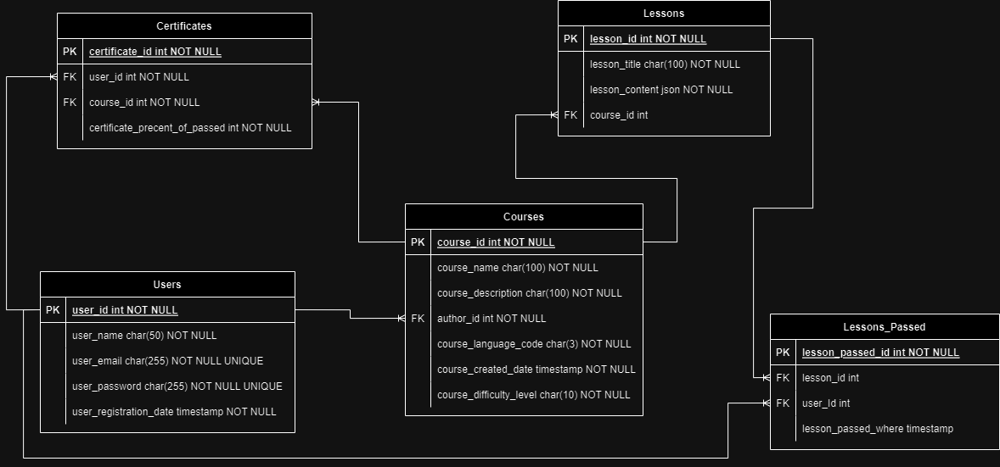

# 18. Онлайн-платформа для обучения иностранным языкам

***
__Команда:__ Александров Виктор Денисович, Ивчик Михаил Юрьевич, Мордовкин Максим Михайлович,
Рахманов Владислав Алексеевич, Рудникова Виктория Олеговна 
***

## Сущности

# Сущности

### Сертификат(Certificate):

* Идентификатор сертификата (CertificateId)
* Идентификатор пользователя, который его получает (UserId)
* Идентификатор курса, по которому выдаётся сертификат (CourseId)Процент выполненной работы по курсу (PercentOfPassed) 

### Курс(Course): 

* Идентификатор(CourseId)
* Название(Title)
* Описание(Description)
* Идентификатор автора (AuthorId)
* Код языка (LanguageCode)
* Дата создания курса (CreatedDate)
* Уровень сложности(DifficultyLevel)

### Урок(Lesson): 

* Идентификатор(LessonId)
* Название(Title)
* Материал урока(Content)
* Идентификатор Курса, к которому относится урок (CourseId)

### Пройденный урок(LessonPassed):

* Идентификатор сданного урока (LessonPassedId)
* Идентификатор урока (LessonId)
* Идентификатор пользователя, который выполнил урок (UserId)
* Дата, когда пользователь закончил урок (LessonPassedDate)

### Пользователь(User):

* Идентификатор(UserId)
* Имя(FirstName)
* Фамилия(LastName)
* Электронная почта(Email)
* Пароль(Password)
* Дата регистрации(RegistrationDate)
***
## Методы API

Методы для работы с курсами, уроками, студентами и преподавателями.

## Регистрация, авторизация и просмотр профиля

### **Регистрация пользователя - POST /api/signup/**

```json
request:
{
    "firstName": "Svyatozar",
    "lastName": "Kapibarov",
    "email": "sobakasutulaya@gmail.com",
    "password": "123456"
}

response:
{
    "status": "ok"
}
```

### **Авторизация пользователя - POST /api/login/**

```json
request:
{
    "email": "sobakasutulaya@gmail.com",
    "password": "123456"
}

response:
{
    "status": "ok"
}
```

### **Получение информации о пользователе - GET /api/users/user_id/**

```json
request:
{
    "userId": 1
}

response:
{
    "userId": 1,
    "firstName": "Svyatozar",
    "lastName": "Kapibarov",
    "email": "sobakasutulaya@gmail.com",
    "registrationDate": "2021-01-01"
}
```

### **Мой профиль - GET /api/my_profile/**

```json
request:
{
}

response:
{
    "userId": 1,
    "firstName": "Svyatozar",
    "lastName": "Kapibarov",
    "email": "sobakasutulaya@gmail.com",
    "registrationDate": "2021-01-01"
}
```

### **Мои курсы - GET /api/my_profile/my_courses/**

```json
request:
{
}

response:
{
    "courses": [
        {
            "courseId": 1,
        },
        {
            "courseId": 2,
        }
    ]
}
```

### **Мои сертификаты - GET /api/my_profile/my_certificates/**

```json
request:
{
}

response:
{
    "certificates": [
        {
            "courseId": 1,
        },
        {
            "courseId": 2,
        }
    ]
}
```

### **Мои авторские курсы - GET /api/my_profile/my_authorship/**

```json
request:
{
}

response:
{
    "courses": [
        {
            "courseId": 1,
        },
        {
            "courseId": 2,
        }
    ]
}
```


### **Редактирование профиля - PUT /api/my_profile/edit_profile/**

```json
request:
{
    "firstName": "Svyatozar",
    "lastName": "Kapibarov",
    "email": "anothersobakasutulaya@gmail.com",
    "password": "12345aboba"
}

response:
{
    "status": "ok"
}
```

### **Удаление профиля - DELETE /api/my_profile/delete_profile/**

```json
request:
{
}

response:
{
    "status": "ok"
}
```


## Поиск курсов, уроков и студентов

### **Получение списка курсов - GET /api/courses/**

```json
request:
{
}

response:
{
    "courses": [
        {
            "courseId": 1,
            "title": "Course 1",
            "description": "Description 1",
            "authorId": 1,
            "languageCode": "en",
            "createdDate": "2021-01-01",
            "difficultyLevel": "intermediate"
        },

        {
            "courseId": 2,
            "title": "Course 2",
            "description": "Description 2",
            "authorId": 2,
            "languageCode": "kz",
            "createdDate": "2021-01-01",
            "difficultyLevel": "advanced"
        }
    ]
}
```

### **Получение курса по названию - GET /api/courses/course_id**

```json
request:
{
    "title": "Course 1"
}

response:
{
    "courseId": 1,
    "title": "Course 1",
    "description": "Description 1",
    "authorId": 1,
    "languageCode": "en",
    "createdDate": "2021-01-01",
    "difficultyLevel": "intermediate"
}
```

### **Получение курса по id - GET /api/courses/course_id**

```json
request:
{
    "courseId": 1
}

response:
{
    "courseId": 1,
    "title": "Course 1",
    "description": "Description 1",
    "authorId": 1,
    "languageCode": "en",
    "createdDate": "2021-01-01",
    "difficultyLevel": "intermediate"
}
```

### **Получение урока по id - GET /api/lessons/lesson_id**

```json
request:
{
    "id": 1
}

response:
{
    "lessonId": 1,
    "title": "Lesson 1",
    "content": "Content 1",
    "courseId": 1
}
```

### **Получение списка уроков по id курса - GET /api/lessons/course_id**

```json
request:
{
    "courseId": 1
}

response:
{
    "lessons": [
        {
            "lessonId": 1,
        },

        {
            "lessonId": 2,
        }
    ]
}
```

### **Получение списка пройденных уроков по id пользователя - GET /api/lessons/user_id**

```json
request:
{
    "userId": 1
}

response:
{
    "lessons": [
        {
            "lessonId": 1,
        },

        {
            "lessonId": 2,
        }
    ]
}
```

### **Получение списка студентов курса - GET /api/courses/course_id/students/**

```json
request:
{
}

response:
{
    "students": [
        {
            "userId": 1,
        },
        {
            "userId": 2,
        }
    ]
}
```

### **Получение автора курса - GET /api/courses/course_id/author/**

```json
request:
{
}

response:
{
    "author": {
        "userId": 1,
    }
}
```

### **Получение списка курсов автора - GET /api/courses/author_id/courses**

```json
request:
{
    "authorId": 1
}

response:
{
    "courses": [
        {
            "courseId": 1,
        },
        {
            "courseId": 2,
        }
    ]
}
```

## Создание и редактирование курсов

### **Создание курса - POST /api/courses/add_course**

```json
request:
{
    "title": "Course 1",
    "description": "Description 1",
    "authorId": 1,
    "languageCode": "en",
    "difficultyLevel": "intermediate"
}

response:
{
    "status": "ok"
}
```

### **Редактирование курса - PUT /api/courses/course_id/edit_course**

```json
request:
{
    "courseId": 1,
    "title": "Course 1",
    "description": "Changed description 1",
    "authorId": 1,
    "languageCode": "en",
    "difficultyLevel": "intermediate"
}

response:
{
    "status": "ok"
}
```

### **Удаление курса - DELETE /api/courses/course_id/delete_course**

```json
request:
{
    "courseId": 1
}

response:
{
    "status": "ok"
}
```


### **Создание урока на курсе - POST /api/courses/course_id/lessons/add_lesson**

```json
request:
{
    "title": "Lesson 1",
    "content": "Content 1",
    "courseId": 1
}

response:
{
    "status": "ok"
}
```

### **Редактирование урока - PUT /api/courses/course_id/lessons/edit_lesson**

```json
request:
{
    "lessonId": 1,
    "title": "Lesson 1",
    "content": "Changed content 1",
    "courseId": 1
}

response:
{
    "status": "ok"
}
```

### **Удаление урока - DELETE /api/courses/course_id/lessons/delete_lesson**

```json
request:
{
    "lessonId": 1
}

response:
{
    "status": "ok"
}
```

## Обучение на курсе

### **Поступление на курс - POST /api/courses/course_id/apply**

```json
request:
{
    "courseId": 1,
    "userId": 1
}

response:
{
    "status": "ok"
}
```

### **Отчисление с курса - DELETE /api/courses/course_id/leave**

```json
request:
{
    "courseId": 1,
    "userId": 1
}

response:
{
    "status": "ok"
}
```


### **Прохождение урока - POST /api/lessons/lesson_id/submit**

```json
request:
{
    "lessonId": 1,
    "userId": 1
}

response:
{
    "status": "ok"
}
```

### **Загрузка сертификата - GET /api/courses/course_id/certificates/download_certificate**

```json
request:
{
    "courseId": 1,
    "userId": 1
}

response:
{
    "status": "ok"
}
```

## Управление студентами на авторском курсе


### **Добавление студента на курс - POST /api/courses/course_id/students/add_student**

```json
request:
{
    "courseId": 1,
    "userId": 1
}

response:
{
    "status": "ok"
}
```

### **Удаление студента с курса - DELETE /api/courses/course_id/students/delete_student**

```json
request:
{
    "courseId": 1,
    "userId": 1
}

response:
{
    "status": "ok"
}
```

### **Выдача сертификата - POST /api/courses/course_id/certificates/give_certificate**

```json
request:
{
    "courseId": 1,
    "userId": 1,
    "percentOfPassed": 100
}

response:
{
    "status": "ok"
}
```
